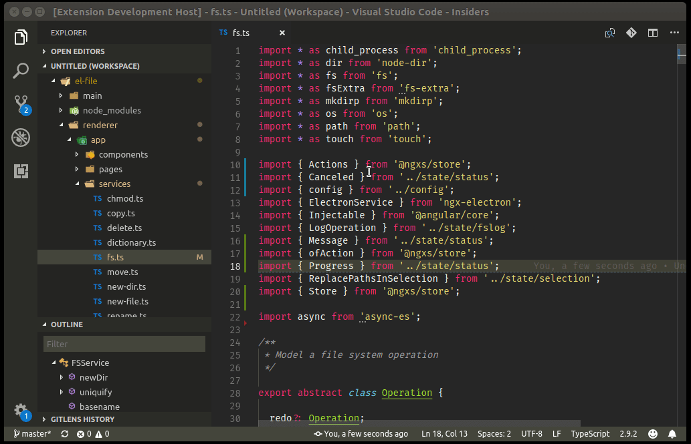

# import-splitnsort

My first idiosyncratic VS Code extension that perhaps only I will ever use! There are many excellent import sorters available -- [sort-imports](https://marketplace.visualstudio.com/items?itemName=amatiasq.sort-imports) for example but `import-splitnsort` is opinionated:

* imports that reference multiple exports can be *organized* but they can't really be *sorted* without breaking them up
* if you try to import multiple exports from the same module in one statement, sooner or later you violate the `tslint:line-length` rule; this often hits me with imports from `@angular/core` 
* multi-export imports don't help you eyeball your imports and disguise their 'weight'

## Features

Automatically splits and sorts imports on save. You can disable this behavior in the settings and split'n'sort manually.

* Launch the command palette with `Ctrl+Shift+P` (`Cmd+Shift+P` on Mac)
* Enter `Split and sort imports`

Imports are sorted case-insensitive and broken into 5 categories, in this order:

1. `import * as vscode from 'vscode'; // namespace imports`
2. `import { ChangeDetectionStrategy } from '@angular/core'; // named imports` 
3. `import $ from 'JQuery'; // default imports`
4. `import zip = require('./ZipCodeValidator'); // external imports`
5. `import 'code.js'; // string imports`

## Extension Settings

`import-splitnsave.on-save` enable auto spli on save (default `true`)

## Release Notes

### 1.0.0

## Credits

Developed by [Mark Florence](https://github.com/mflorence99).

## Thanks

Many thanks to [sort-imports](https://marketplace.visualstudio.com/items?itemName=amatiasq.sort-imports) for showing the way!

Special thanks to [typescript-parser](https://buehler.github.io/node-typescript-parser/) fir a really nice and easy-to-use TypeScript to AST parser.
